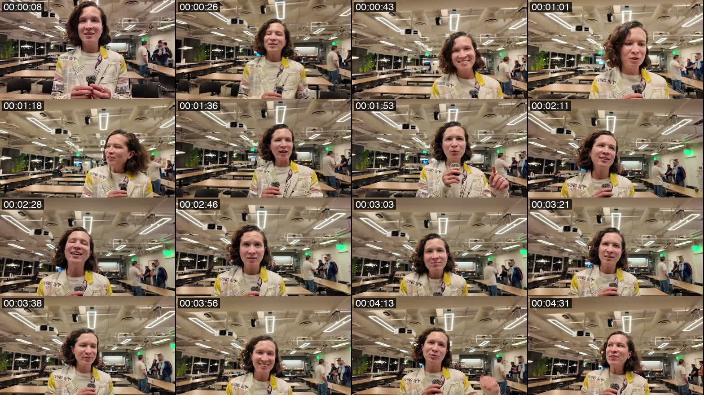
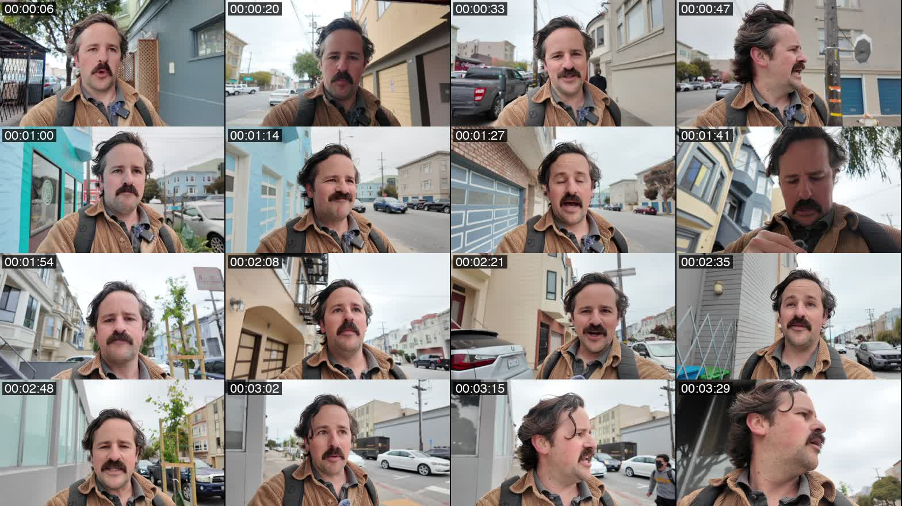
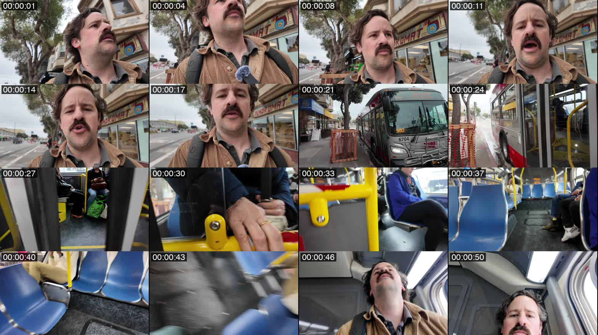
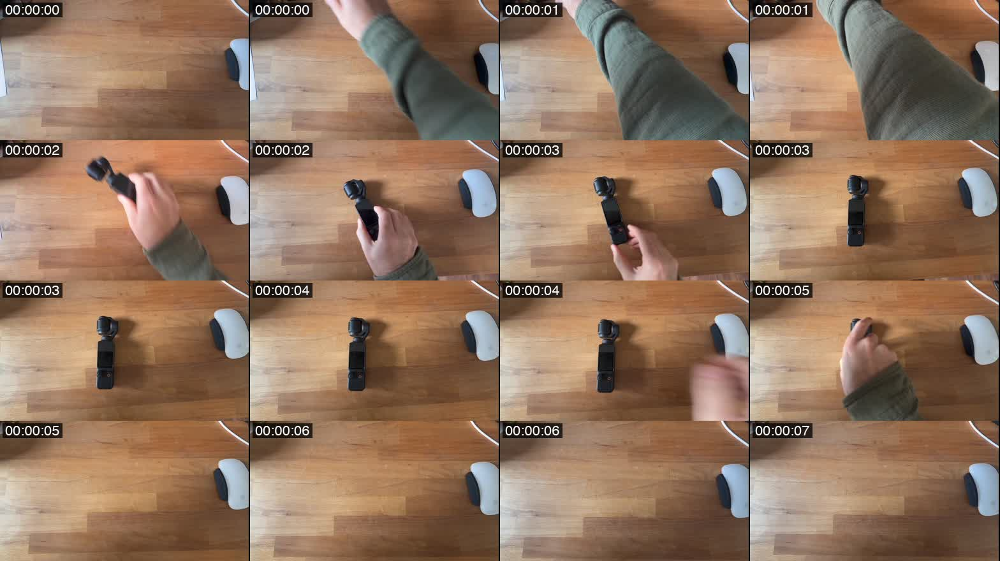

# Visual analysis patterns

Match each clip's grid montage against the four patterns below and apply the closest one. The final section shows the shape of the per-clip summary you'll write.

The grid images referenced here (`static-interview.jpg`, `walk-and-talk.jpg`, `city-vlog-broll.jpg`, `desk-broll.jpg`) live alongside this file — read them in the same parallel batch as this markdown.

---

## Pattern 1: Static interview / talking head

The grid shows a 4:40 interview. Camera position, framing, and lighting hold constant — only the subject's expressions and minor background movement change.

For stationary shots like this, write **one short description** on the first dialogue segment. No `visual` fields needed on any other segment.

### Grid



### Example description

> A light-skinned woman in her mid-30s with curly brown hair, in a newspaper-print jacket, answers interview questions inside a bright coworking space, with meetup attendees behind her. She holds a lavalier mic; handheld medium shot at slight low angle.

### What to include

- **Subject** (estimated age, gender presentation, hair color, skin tone — if obvious)
- **Activity** ("answering interview questions" vs "speaking to camera" vs "presenting on stage")
- **Location** in plain language ("office," "kitchen," "front porch," "Disneyland," "Downtown Tokyo," etc.)
- **A few elements behind them** if it adds context (attendees, traffic, kids playing)
- **Shot type and camera handling** (medium / handheld / low angle)

### What to leave out

- Exact text on clothing or signs unless it's the headline detail
- Hardware specifics (mic model, windscreen material, projector mount, ductwork)
- Counts (number of people in background, number of tables)
- The subject's expression or behavior moment-to-moment — that lives in the dialogue
- Lighting fixtures, ceiling materials, furniture descriptions

---

## Pattern 2: Walk-and-talk vlog

The grid shows a 3:36 selfie-style walking vlog. The subject walks through a neighborhood while speaking to camera, and the background changes constantly as he moves. Despite that, this is mechanically **one continuous shot** — the editorial value is the dialogue, not the scenery, and an editor will reach for this clip because of what's said in it.

Treat it the same as a static interview: write **one short description** on the first dialogue segment. No `visual` fields needed on any other segment. Things like the subject glancing aside, fiddling with the mic, or new buildings appearing behind him are not cuts and don't warrant new visual entries.

### Grid



### Example description

> A light-skinned man in his mid-30s with dark hair and a bushy mustache, in a tan corduroy jacket, walks through a San Francisco residential neighborhood while talking to camera. Selfie-style handheld medium close-up, lavalier mic clipped to his lapel. Overcast daylight.

### What to include

- **Subject** (estimated age, gender presentation, hair color, skin tone — if obvious)
- **Activity** ("walking and talking to camera," "narrating while exploring")
- **Location** in plain language ("San Francisco residential neighborhood," "Tokyo arcade," "trail through redwoods")
- **Shot type and camera handling** (selfie-style handheld medium close-up / gimbal-stabilized / over-shoulder)

### What to leave out

- Specific buildings, cars, signs, or scenery that come and go as he walks
- Subject's behavior moment-to-moment (looking around, checking the mic, glancing aside) — that lives in the dialogue
- Pedestrians or other passers-by unless they become part of the story
- Hardware specifics (mic model, jacket brand)
- Counts (number of houses, cars at the curb)

### Exception

If the vlogger explicitly turns the camera to show something specific ("Whoa, look at that mural over there…"), add a single waypoint visual at that moment describing what they're showing. Otherwise, one description covers the whole clip.

---

## Pattern 3: Multi-shot b-roll (city vlog)

The grid shows a 52-second clip filmed for visual coverage — the vlogger transitioning from a city sidewalk to boarding and riding a bus. Unlike static-interview or walk-and-talk, **the editorial value is the visuals, not the dialogue**. An editor pulls this clip for the shot of the bus arriving or the interior, not for anything that's said.

For shots like this, identify the **narrative beats** from the grid alone (no extra frame extraction) and write a visual description at each. Use the audio transcript as a secondary signal: a countdown ending often marks a transition, ambient passenger chatter signals the subject isn't driving the moment.

### Grid



### Example beats

| Time | Visual |
|------|--------|
| 00:00:01 | A light-skinned man in his mid-30s with dark hair and a bushy mustache, in a tan corduroy jacket, waits at a city bus stop on a sidewalk outside a laundromat. Trees and street traffic behind him. Selfie-style low-angle handheld. |
| 00:00:21 | An SF Muni bus arrives at the stop; he turns to board. |
| 00:00:27 | Inside the bus, walking past seated passengers — yellow grab bars and blue vinyl seats. |
| 00:00:43 | Now seated, low-angle shot looking up at the bus skylight as it moves. |

### What to include

- **First beat: full subject + setting** — same detail level as static-interview's opening (estimated age, gender presentation, hair color, skin tone, wardrobe, location, shot type)
- **Subsequent beats: concrete, brief, focused on what's new in the frame**
- **Identifiable details** an editor could search by (LAUNDROMAT sign, SF Muni bus, distinctive passenger detail, motion-blur shot)
- **Narrative function** in plain language — what's actually happening ("arrives," "boards," "sits down")

### What to leave out

- A description on every audio segment — only at visual transitions
- Mood/vibe descriptors without concrete content ("intimate framing," "soft diffused interior light," "minimalist composition")
- Re-describing the subject on every beat
- Treating ambient passenger chatter as if it drives a new visual beat
- Listing every micro-change as a separate beat — prefer a few high-signal narrative beats over many redundant ones

---

## Pattern 4: Fixed-frame, content evolves (desk b-roll)

The grid shows a 7-second overhead b-roll clip. The camera doesn't move — it's locked above a wooden desk — but the **content** of the frame changes: empty desk → hand enters with a small camera → camera stands alone → hand retrieves it → empty again.

Unlike static-interview or walk-and-talk where one description covers the whole clip, here the content IS the visual story. Write a description at each meaningful state change. Because the camera is fixed, don't re-describe the setting on every beat — just what's new or what changed.

### Grid



### Example beats

| Time | Visual |
|------|--------|
| 00:00:00 | Overhead shot of a wooden desk, looking straight down. An Apple Magic Mouse sits on the right edge; a white cable runs along the top. Warm interior lighting, locked-off camera, no people in frame. |
| 00:00:02 | A hand in an olive-green sleeve places a small black DJI Pocket camera upright on the desk, gimbal head pointing up. |
| 00:00:03 | The hand pulls away; the camera stands alone in frame. |
| 00:00:05 | The hand reaches back in and removes the camera, leaving the desk empty again. |

### What to include

- **First beat: full setting** — what's already in the frame, the shot type (overhead, eye-level, low-angle), lighting
- **Subsequent beats: only what's new or what changed** — an object placed, a hand entering, a state transition
- **Object identification** when an item is identifiable from the grid (DJI Pocket, MacBook Pro, specific mug, etc.)

### What to leave out

- Re-describing the desk on every beat — it doesn't change
- Mood/vibe descriptors ("intimate workspace," "warm minimal aesthetic," "creative energy")
- Tiny mid-motion frames (the blurry hand in transit) as their own beats — group them under the state they're entering or leaving
- Pretending the camera moved when it didn't

---

## Summary shape

Below is a worked example of a complete per-clip summary. Match this structure when you write each clip's summary file:

```markdown
# DJI_20250423212229_0253_D.mov
**Duration:** 04:05

## Overview
Interview-style vlog segment in a modern coworking space. The on-camera subject is **Irina Nazarova, CEO of Evil Martians and host of the SF Ruby meetup**, wearing a distinctive newspaper-print jacket with yellow accents. Andrew (off-camera) runs her through a rapid-fire Q&A: name and hometown, favorite Ruby gem, AI/jobs question, and a bonus LLM question. Irina's answers cover her favorite Ruby thing (Ruby on WebAssembly), her AI take ("they already did… we're in a simulation"), and her LLM tools (Claude desktop, Perplexity, Bolt.me).

## Key Visuals
- Handheld interview setup in a bright modern coworking space with wooden tables and fluorescent lighting
- Subject framed in medium shots with visible lavalier microphone
- Distinctive newspaper-print jacket with yellow accents
- Consistent documentary interview style; subject animated and engaged

## Notable Dialogue
> [00:11] "The reason I became a programmer was Ruby meetups. I was self-taught, and I couldn't afford to go to bootcamp."
> [01:51] "My favorite Ruby thing is Ruby running in the browser, Ruby on WebAssembly stuff, just because I can play with it from anywhere."
> [02:46] "Yeah, I think they already did [take our jobs]. We are in a simulation built by robots for all of us."
> [04:00] "I use Claude. I use Perplexity for different things... for small demo apps, I use Bolt.me."

## B-Roll
- Interview framing with natural handheld movement; suitable for talking-head clips or montages about developer experiences
```
